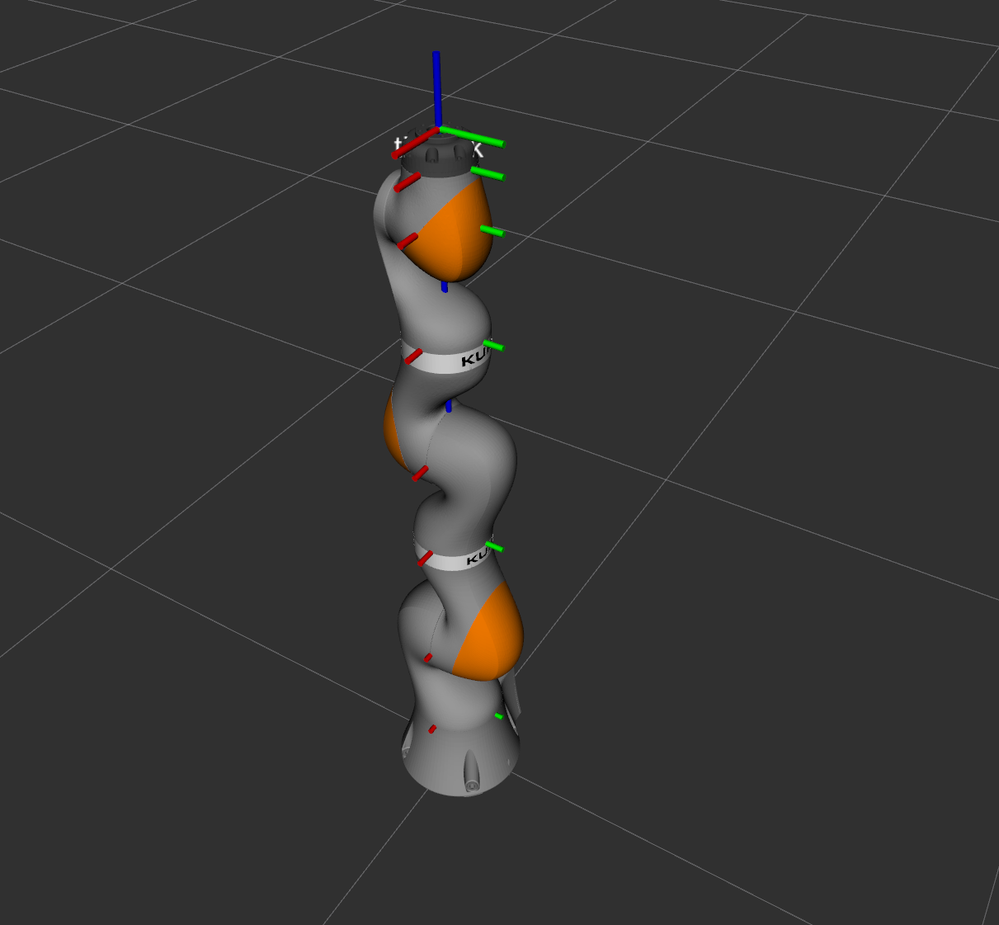

# ros_tutorials2

Tutorials Code URDF, Gazebo, ros_control for LBR  iiwa 14 r850

## URDF Modeling

## Gazebo Simulation

    
    
    

Reference:
- [LBR iiwa | KUKA AG](https://www.kuka.com/en-de/products/robot-systems/industrial-robots/lbr-iiwa)
- [Download Center | KUKA AG](https://www.kuka.com/en-us/services)
